<div align="center">
<h1>🧠 Echo-Memory</h1>
<p><b>A Controlled Study of Memory in Action World Models</b></p>
<p><b>Echo Team @ Joy Future Academy, JD</b></p>
</div>

<div align="center">
<a href="#"></a>
<a href="#"></a>
<a href="#"></a>
<a href="https://github.com/WayneJin0918/Echo-Memory"></a>
</div>

> **Core question.** When a generated scene must leave and later return, which kind of memory helps an action world model preserve **identity**, **layout**, and **viewpoint** instead of drifting into a plausible but different world?

<div align="center">
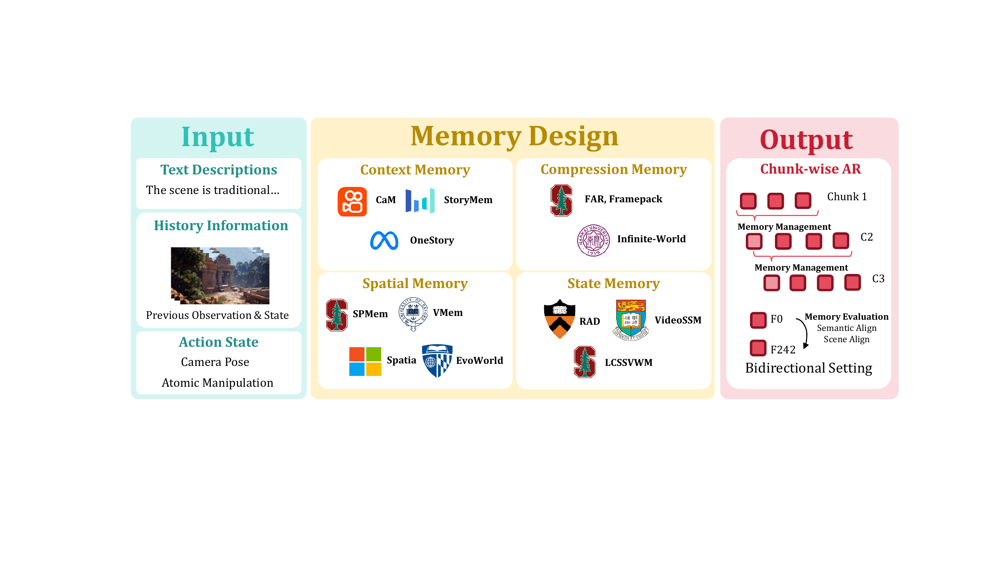
</div>

<p align="center">
<b>Paper teaser.</b> Echo-Memory studies how Context, Compression, Spatial, and State-Space memory carry historical observations across chunk-wise action-world generation and revisit trajectories.
</p>

**Echo-Memory** is the release code for the paper's controlled memory study. It keeps the shared **Wan video backbone**, memory modules, training recipes, data utilities, open-domain revisit assets, and public replay/static evaluation suites.

**What is included:** reproducible memory rows, paper-aligned ablation scripts, GT replay, in-domain revisit, open-domain revisit, visual evidence frames, and representative videos.

**What is intentionally removed:** private dynamic benchmarks, cluster submit files, logs, generated outputs, and machine-local paths.

## Authors and Release Statement

This repository is released by **Echo Team @ Joy Future Academy, JD**. The code and evaluation assets are intended to support reproducible memory-mechanism comparisons for action-conditioned video world models. If you use this repository, please cite the Echo-Memory paper or acknowledge the Echo Team release.

## Visual Assets Included

This release directly includes paper-facing visual assets. Each example is a small diagnostic:

> **First frame → leave the view → revisit tail.**  
> The first frame fixes the world state, the trajectory moves away, and the revisit tail shows whether memory brings the model back to the same object, pose, background, and camera geometry.

```text
assets/opendomain_revisit/  Held-out first-frame sources for the open-domain toy-bear revisit probe
assets/paper_cases/         Paper teaser, memory overview, qualitative panels, and first/tail evidence frames
assets/paper_videos/        Representative GT-replay MP4s for key memory rows
assets/readme_previews/     Low-resolution animated GIF previews for direct README playback
```

### 🧩 Memory Context List

<div align="center">
<table>
  <tr>
    <th>Family</th>
    <th>Memory row</th>
    <th>What it tests</th>
  </tr>
  <tr>
    <td><b>Floor</b></td>
    <td><b>No memory / I2V floor</b></td>
    <td>Re-generate from the first frame only; a lower bound for revisit consistency.</td>
  </tr>
  <tr>
    <td><b>Raw context</b></td>
    <td><b>Context K=1 / K=5 / K=20</b></td>
    <td>Whether simply keeping more recent frames is enough to prevent long-horizon drift.</td>
  </tr>
  <tr>
    <td><b>Compression</b></td>
    <td><b>FramePack length r=4</b></td>
    <td>Whether a compact temporal representation can retain useful history without raw-frame growth.</td>
  </tr>
  <tr>
    <td><b>Spatial</b></td>
    <td><b>Spatial Memory</b></td>
    <td>Whether explicit spatial read/write state improves scene-layout recall.</td>
  </tr>
  <tr>
    <td><b>State-space</b></td>
    <td><b>Legacy VideoSSM Hybrid / Block-wise SSM</b></td>
    <td>Whether recurrent state updates can stabilize revisits beyond short context windows.</td>
  </tr>
</table>
</div>

<div align="center">
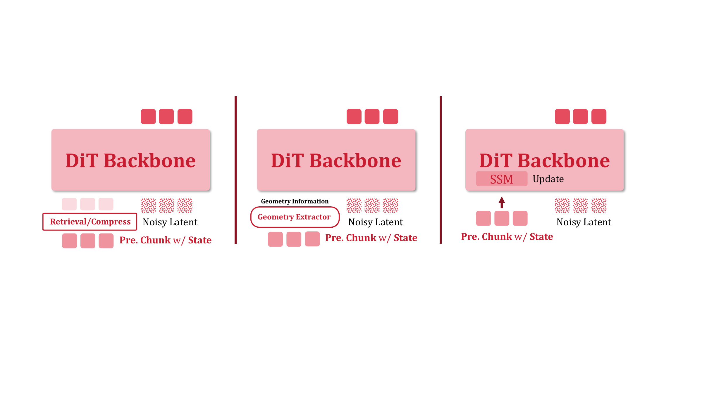
</div>

<p align="center">
<b>Memory design matrix.</b> The paper groups concrete variants by what is stored and how it is read back: raw context, compressed history, spatial state, or recurrent state-space memory.
</p>

<div align="center">
<table>
  <tr>
    <td align="center">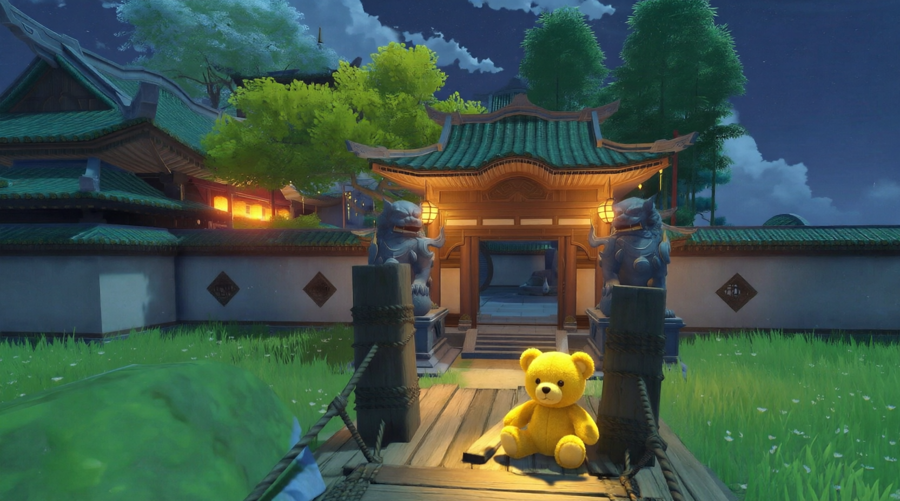<br>Open-domain source 1</td>
    <td align="center">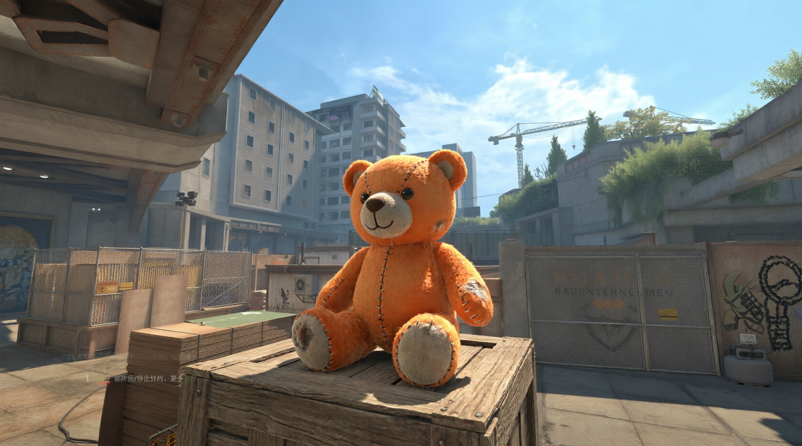<br>Open-domain source 2</td>
    <td align="center">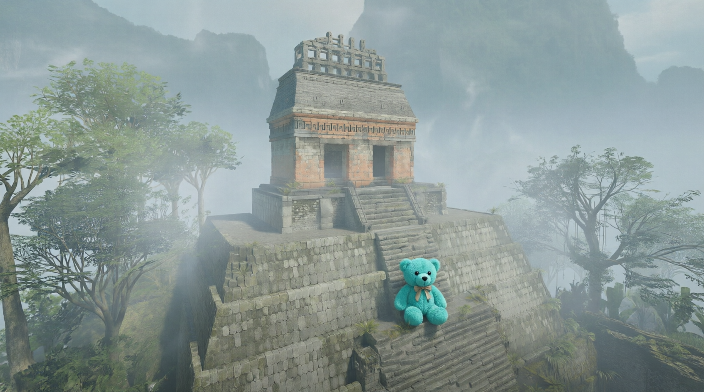<br>Open-domain source 3</td>
    <td align="center">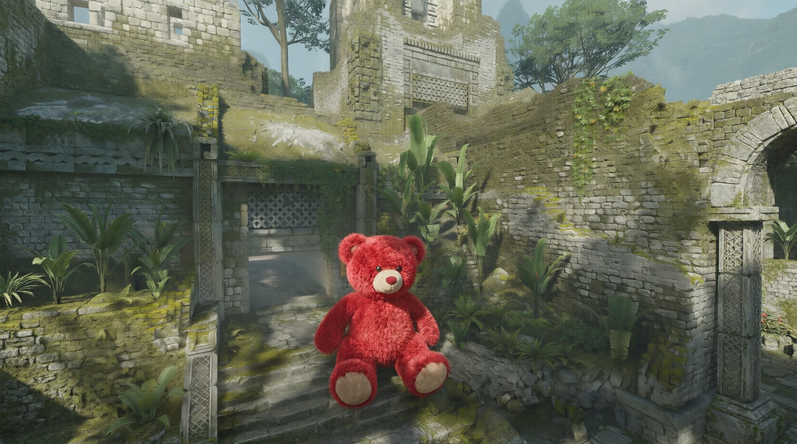<br>Open-domain source 4</td>
  </tr>
  <tr>
    <td align="center">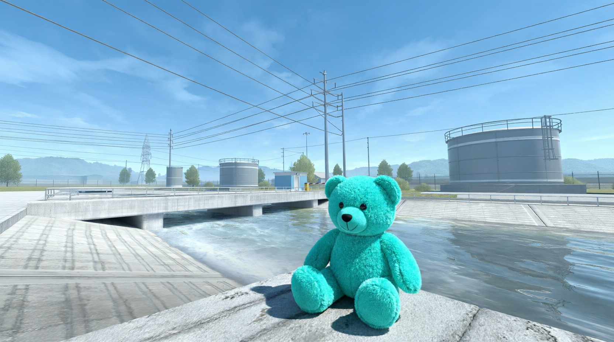<br>Open-domain source 5</td>
    <td align="center">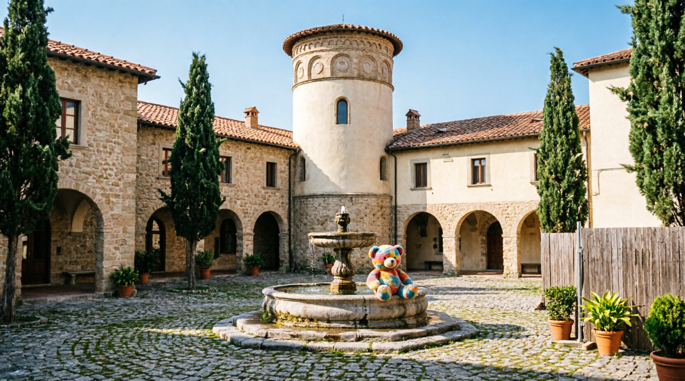<br>Open-domain source 6</td>
    <td align="center">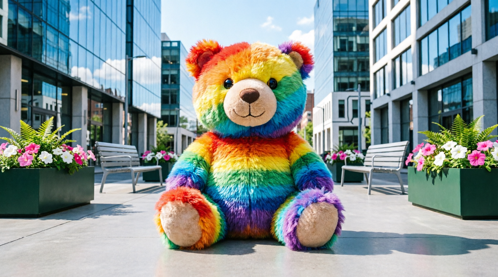<br>Open-domain source 7</td>
    <td align="center"><br>Open-domain source 8</td>
  </tr>
</table>
</div>

### 🎬 Replay Video List

**Representative replay videos** are included as compressed README previews plus full MP4 files. These clips replay ground-truth trajectories with each memory mechanism, making it easier to compare **local fidelity**, **motion smoothness**, and whether the generated chunk stays anchored to earlier visual evidence.

> **GitHub note:** the animated previews below are low-resolution GIFs for direct playback in the README. The MP4 links point to the higher-quality GitHub Release assets.

<div align="center">
<table>
  <tr>
    <td align="center">
      <b>Context K=1</b><br>
      <br>
      <a href="https://github.com/WayneJin0918/Echo-Memory/releases/download/readme-video-assets-v1/context_k1_replay_gt.mp4">Full MP4</a>
    </td>
    <td align="center">
      <b>Context K=5</b><br>
      <br>
      <a href="https://github.com/WayneJin0918/Echo-Memory/releases/download/readme-video-assets-v1/context_k5_replay_gt.mp4">Full MP4</a>
    </td>
    <td align="center">
      <b>Context K=20</b><br>
      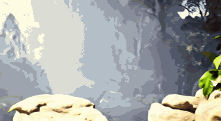<br>
      <a href="https://github.com/WayneJin0918/Echo-Memory/releases/download/readme-video-assets-v1/context_k20_replay_gt.mp4">Full MP4</a>
    </td>
  </tr>
  <tr>
    <td align="center">
      <b>FramePack length r=4</b><br>
      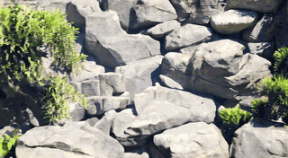<br>
      <a href="https://github.com/WayneJin0918/Echo-Memory/releases/download/readme-video-assets-v1/framepack_len_r4_replay_gt.mp4">Full MP4</a>
    </td>
    <td align="center">
      <b>Spatial Memory</b><br>
      <br>
      <a href="https://github.com/WayneJin0918/Echo-Memory/releases/download/readme-video-assets-v1/spatial_memory_replay_gt.mp4">Full MP4</a>
    </td>
    <td align="center">
      <b>Legacy VideoSSM Hybrid</b><br>
      <br>
      <a href="https://github.com/WayneJin0918/Echo-Memory/releases/download/readme-video-assets-v1/ssm_legacy_replay_gt.mp4">Full MP4</a>
    </td>
  </tr>
  <tr>
    <td align="center" colspan="3">
      <b>Block-wise SSM</b><br>
      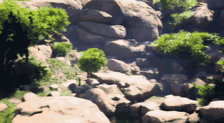<br>
      <a href="https://github.com/WayneJin0918/Echo-Memory/releases/download/readme-video-assets-v1/ssm_blockwise_replay_gt.mp4">Full MP4</a>
    </td>
  </tr>
</table>
</div>

## Layout

```text
diffsynth/                  Core model, pipeline, trainer utilities
src/model_training/         Main training code and memory/context helpers
src/model_inference/        Stage-2 inference entrypoints
src/data/                   Dataset metadata construction utilities
train/                      Public training recipes
eval/v2/                    Static consistency and basic GT replay eval
eval/metrics/               Visual/basic capability metrics
scripts/                    Data construction and latent precompute scripts
assets/opendomain_revisit/  Held-out first frames for open-domain revisit
assets/paper_cases/         Paper qualitative panels and per-method visual evidence
assets/paper_videos/        Representative paper replay videos
assets/readme_previews/     README-friendly animated previews
env/                        Shared runtime helpers and action JSONs
tests/                      Focused checks for memory/context plumbing
```

## Installation

```bash
conda env create -f environment.yml
conda activate echo-memory
pip install -r requirements.txt
```

If your CUDA/Torch stack requires a custom `flash-attn` wheel, install it after the base environment is ready.

Configure `accelerate` for your machine before multi-GPU training:

```bash
accelerate config
```

## Required Paths

Most scripts are path-portable and use environment variables:

```bash
export WAN_BASE_MODEL=/path/to/Wan2.1-T2V-1.3B
export DATASET_BASE_PATH=/path/to/Context-as-Memory-Dataset
export PYTHONPATH=$PWD:${PYTHONPATH:-}
```

`WAN_BASE_MODEL` should contain `diffusion_pytorch_model.safetensors`, `models_t5_umt5-xxl-enc-bf16.pth`, and `Wan2.1_VAE.pth`.

## Training

Memory baseline recipes live in `train/memory_baselines_basic/`. These map to the paper matrix:

```bash
bash train/memory_baselines_basic/run_ablation_no_memory_baseline_two_chunk.sh
bash train/memory_baselines_basic/run_ablation_framepack_weight_two_chunk.sh
bash train/memory_baselines_basic/run_ablation_framepack_len_r2_two_chunk.sh
bash train/memory_baselines_basic/run_ablation_framepack_len_r4_two_chunk.sh
bash train/memory_baselines_basic/run_ablation_framepack_hybrid_r2_weight_two_chunk.sh
bash train/memory_baselines_basic/run_ablation_framepack_hybrid_r4_weight_two_chunk.sh
bash train/memory_baselines_basic/run_spatial_memory_baseline.sh
bash train/memory_baselines_basic/run_ablation_spatial_inject_none_two_chunk.sh
bash train/memory_baselines_basic/run_ablation_spatial_concat_text_two_chunk.sh
bash train/memory_baselines_basic/run_ablation_spatial_cross_attn_readout_two_chunk.sh
bash train/memory_baselines_basic/run_videossm_hybrid_baseline.sh
bash train/memory_baselines_basic/run_ablation_block_wise_ssm_two_chunk.sh
```

Context learning recipes live in `train/context_learning/`:

```bash
bash train/context_learning/run_pre_qkv_ctx1.sh
bash train/context_learning/run_pre_qkv_ctx5.sh
bash train/context_learning/run_pre_qkv_ctx20.sh
```

Outputs default to `outputs/`. Override with `OUTPUT_BASE_ROOT=/path/to/outputs`.

## Data Construction

Generate metadata for a Context-as-Memory style dataset:

```bash
export DATASET_BASE_PATH=/path/to/Context-as-Memory-Dataset
bash scripts/run_generate_metadata.sh
```

Precompute context and target latents:

```bash
export WAN_BASE_MODEL=/path/to/Wan2.1-T2V-1.3B
export DATASET_BASE_PATH=/path/to/Context-as-Memory-Dataset
NUM_PROCESSES=8 bash scripts/run_precompute_ctx_target_latents.sh
```

## Evaluation

Run the paper evaluation bundle for a checkpoint:

```bash
export WAN_BASE_MODEL=/path/to/Wan2.1-T2V-1.3B
export DATASET_BASE_PATH=/path/to/Context-as-Memory-Dataset
export CKPT=/path/to/epoch-0.safetensors
bash eval/v2/run_static_consistency_loop_and_revisit.sh
bash eval/v2/run_basic_replay_gt.sh
```

Run the open-domain revisit suite with the released first frames:

```bash
export WAN_BASE_MODEL=/path/to/Wan2.1-T2V-1.3B
export DATASET_BASE_PATH=/path/to/Context-as-Memory-Dataset
PHASE=stage1 OOD_DIR=assets/opendomain_revisit \
  bash eval/v2/revisit_suite/run_one_click_revisit_eval.sh
```

If an OpenAI-compatible VLM endpoint is available, add `PHASE=vlm` or run the default `PHASE=all` with `VLM_API_BASE` and `VLM_MODEL`.

## Visualization and Paper Cases

This repository directly includes the qualitative assets used to inspect the paper's representative open-domain case.

> **Open-domain revisit setup.** Start from a held-out toy-bear image, turn away, and return with a **45-degree revisit action**. The task is intentionally simple to read but hard for memory: the model must recover the same foreground object and nearby scene evidence after leaving the initial view.

**Compact paper panel:**

```text
assets/paper_cases/representative_sweep_panel.png
assets/paper_cases/representative_sweep_panel_highres.png
assets/paper_cases/manifest.csv
```

<div align="center">
<table>
  <tr>
    <th>Variant</th>
    <th>First frame</th>
    <th>Revisit tail</th>
  </tr>
  <tr>
    <td>No memory / I2V floor</td>
    <td></td>
    <td>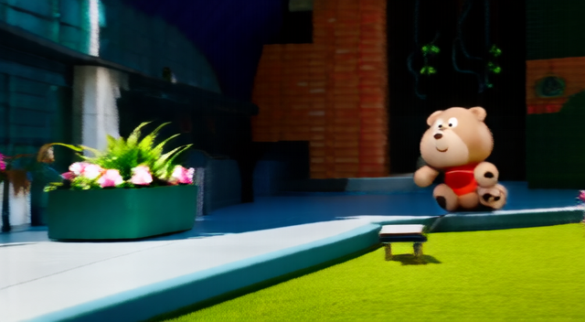</td>
  </tr>
  <tr>
    <td>Context K=5</td>
    <td></td>
    <td>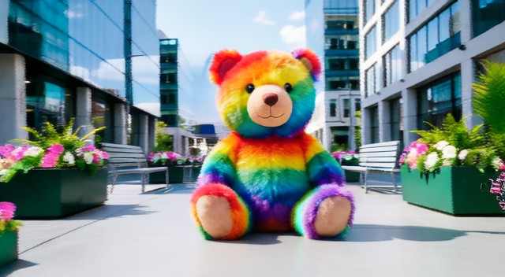</td>
  </tr>
  <tr>
    <td>Context K=20</td>
    <td></td>
    <td>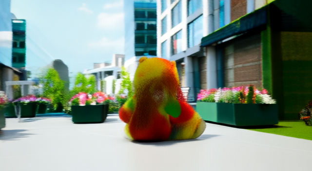</td>
  </tr>
  <tr>
    <td>FramePack length r=4</td>
    <td></td>
    <td>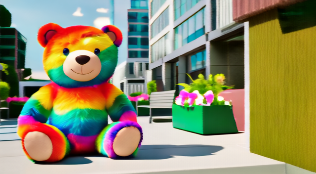</td>
  </tr>
  <tr>
    <td>Spatial Memory</td>
    <td></td>
    <td>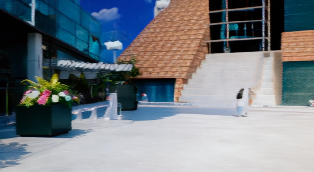</td>
  </tr>
  <tr>
    <td>State-Space legacy hybrid</td>
    <td></td>
    <td>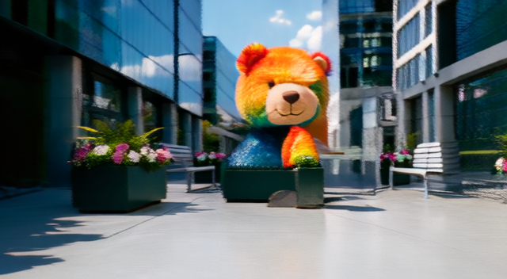</td>
  </tr>
  <tr>
    <td>State-Space block-wise</td>
    <td></td>
    <td>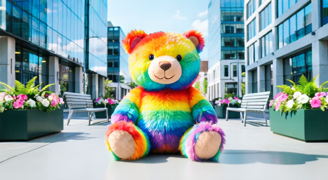</td>
  </tr>
</table>
</div>

**How to read the table:**

- **First frame** is the source condition given to the model before rollout.
- **Revisit tail** shows the final frames after the model leaves the view and returns.
- **Good memory** preserves object identity, similar pose, stable background evidence, and coherent camera return.
- **Common failure modes** include object replacement, texture drift, background rewrite, or a return view that ignores the start.

The evaluation scripts also write videos and evidence images next to their metrics, so newly generated cases can be inspected without any extra conversion step.

GT replay videos:

```text
${CKPT_DIR}/evals_v2/basic/replay_gt/<video>_start<frame>/replay_gt_gen_only.mp4
${CKPT_DIR}/evals_v2/static_consistency/in_domain/long_horizon_gt_replay/*/replay_gt_gen_only.mp4
```

In-domain loop and open-domain revisit videos:

```text
${CKPT_DIR}/evals_v2/static_consistency/in_domain/loop_closure/**/*.mp4
${CKPT_DIR}/evals_v2/static_consistency/in_domain/combo_revisit_in_domain/**/*.mp4
${CKPT_DIR}/evals_v2/static_consistency/open_domain/multiview_revisit/**/*.mp4
eval_outputs/revisit_suite_<timestamp>/stage1/**/revisit_gen_only.mp4
```

Open-domain revisit evidence images, useful for paper figures and qualitative panels:

```text
eval_outputs/revisit_suite_<timestamp>/stage1/**/stage1_frames/first_00.png
eval_outputs/revisit_suite_<timestamp>/stage1/**/stage1_frames/revisit_tail_*.png
eval_outputs/revisit_suite_<timestamp>/stage1/**/stage1_frames/first_last_chunk_changes/*.png
```

To collect paper-ready case tables and image manifests from one or more revisit runs:

```bash
python eval/v2/revisit_suite/export_revisit_materials.py \
  --eval-root eval_outputs/revisit_suite_<timestamp> \
  --out-dir paper_case_materials \
  --prefix echo_memory_revisit
```

For lightweight browsing on a remote machine, serve an output folder and open the URL from your workstation:

```bash
python -m http.server 8000 --directory eval_outputs
```

The released first-frame sources for the open-domain paper cases live in `assets/opendomain_revisit/`. They are the input images behind the toy-bear revisit probe; generated videos and VLM evidence frames are produced by `eval/v2/revisit_suite`.

If MP4 files are generated on a remote machine, open them through the file browser or serve the output directory:

```bash
python -m http.server 8000 --directory eval_outputs
```

Then open `http://<host>:8000/` and navigate to `revisit_suite_<timestamp>/stage1/.../revisit_gen_only.mp4`.

Capability metrics:

```bash
python eval/metrics/run_all_metrics.py --help
python eval/metrics/run_visual_eval.py --help
```

Dynamic evaluation and training are not part of this release.
